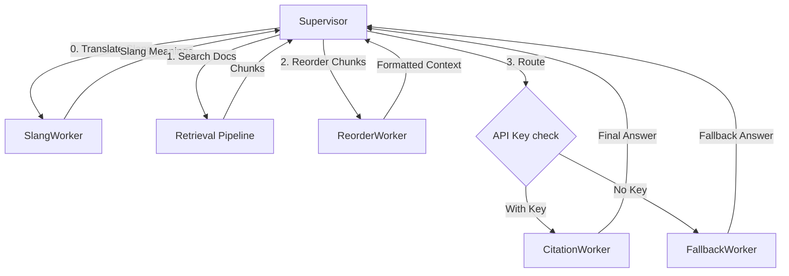
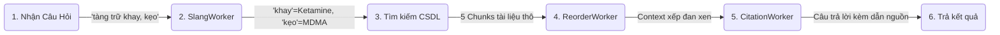

# 🚀 THIẾT KẾ HỆ MULTI-AGENT RAG PHÁP LUẬT
> *Tài liệu đặc tả chi tiết kiến trúc, cấu trúc dữ liệu, và kết quả chạy thử nghiệm dựa trên 6 yêu cầu kỹ thuật cốt lõi.*

---

## 📌 BẢN ĐỒ THỰC THI CÁC YÊU CẦU

| Yêu cầu | Thành phần thực hiện | Cơ chế hoạt động |
| :--- | :--- | :--- |
| **1. Tách Supervisor + Workers** | `Supervisor`, `SlangWorker`, `ReorderWorker`, `CitationWorker`, `FallbackWorker` | Điều phối tuần tự + Rẽ nhánh điều hướng |
| **2. Shared State & Trace Schema** | `RAGSharedState` & `TraceEntry` (Pydantic Models) | Đồng bộ trạng thái và đo thời gian execution |
| **3. External Capability qua MCP** | `SlangWorker` $\rightarrow$ `slang_mcp.py` (Stdio transport) | Giải nghĩa từ lóng ma túy sang từ điển pháp lý |
| **4. Message Contract tối thiểu** | Plain string / JSON string input-output protocols | Định dạng tối giản, phi trạng thái (Stateless) |
| **5. Tracing toàn bộ luồng** | `run_worker()` & `state.trace` logs | In bảng Trace biểu đồ thời gian ra console |
| **6. Demo & Reasoning Flow** | Chạy thử nghiệm query thực tế | Phân tích luồng tư duy quan sát được của LLM |

---

## 📂 1. Yêu Cầu 1: Cấu Trúc Hệ Thống (Supervisor + 4 Workers)

Hệ thống được chuyển đổi từ script đơn `task10_generation.py` thành cấu trúc phân rã gồm 1 Supervisor điều phối và 4 workers chuyên biệt:



* **Supervisor**: Điều phối toàn bộ luồng dữ liệu, thực thi các bước tìm kiếm tài liệu từ CSDL, cập nhật shared state và lưu log trace.
* **SlangWorker**: Tìm kiếm định nghĩa các từ lóng ma túy (được hỗ trợ bởi MCP server bên ngoài).
* **ReorderWorker**: Sắp xếp lại thứ tự tài liệu để tránh hiệu ứng *lost-in-the-middle* (LLM quên thông tin ở giữa prompt).
* **CitationWorker**: Sinh câu trả lời tiếng Việt kèm các thẻ trích dẫn chính xác dạng `[Document i]` thông qua OpenAI.
* **FallbackWorker**: Rút trích thông tin thô khi thiếu API key.

---

## 📊 2. Yêu Cầu 2: Thiết Kế Shared State Schema Với Trường Trace

Trạng thái chia sẻ giữa Supervisor và các workers được chuẩn hóa thông qua Pydantic models:

```python
from pydantic import BaseModel, Field
from typing import List, Dict, Any, Optional

class TraceEntry(BaseModel):
    """Một bước thực thi trong pipeline để giám sát hiệu năng và luồng đi"""
    agent: str          # Tên tác nhân thực hiện: 'Supervisor' | 'SlangWorker' | 'ReorderWorker' | 'CitationWorker' | 'FallbackWorker'
    action: str         # Hành động: 'routing' | 'slang_lookup' | 'retrieve' | 'reorder' | 'citation_generation' | 'fallback_generation' | 'finalize'
    input_summary: str  # Tóm tắt đầu vào (100 ký tự đầu) để debug nhanh
    output_summary: str # Tóm tắt đầu ra (200 ký tự đầu)
    timestamp: str      # Dấu mốc thời gian thực hiện (ISO format)
    duration_ms: float  # Thời gian thực thi đo bằng mili-giây (ms)

class RAGSharedState(BaseModel):
    """Bản thiết kế Shared State chứa toàn bộ thông tin luồng dữ liệu RAG"""
    raw_query: str                          # Câu hỏi thô ban đầu từ User
    refined_query: Optional[str] = None     # Bản dịch nghĩa từ lóng từ SlangWorker
    retrieved_chunks: List[Dict[str, Any]] = Field(default_factory=list) # Danh sách tài liệu tìm thấy
    reordered_context: Optional[str] = None # Văn bản ngữ cảnh đã sắp xếp lại và đánh nhãn
    final_answer: Optional[str] = None      # Câu trả lời cuối cùng trả cho người dùng
    generation_mode: str = "none"           # Phương thức sinh câu trả lời: 'citation' | 'fallback'
    sources_used: int = 0                   # Số lượng nguồn tài liệu được tham chiếu
    trace: List[TraceEntry] = Field(default_factory=list) # Danh sách toàn bộ bước chạy (Trace)
```

---

## 🔗 3. Yêu Cầu 3: Worker Sử Dụng External Capability Qua MCP

Worker `SlangWorker` sử dụng giao thức **Model Context Protocol (MCP)** qua kênh Stdio để kết nối với server [slang_mcp.py](file:///home/henry/Downloads/AI%20in%20action/day8/Day08_RAG_pipeline_cohort2/multi_agent/slang_mcp.py).

### Cấu hình kết nối MCP trong Agent (`multi_agent_rag.py`):
```python
def create_slang_config() -> LocalAgentConfig:
    """Config cho SlangWorker kết nối với Slang MCP Server cục bộ"""
    mcp_path = os.path.join(os.path.dirname(os.path.abspath(__file__)), "slang_mcp.py")
    
    mcp_servers = [
        types.McpStdioServer(
            name="slang_server",
            command=sys.executable,  # Gọi trình thông dịch python hiện tại của môi trường ảo (.venv)
            args=[mcp_path],
        )
    ]
    return LocalAgentConfig(
        system_instructions=CustomSystemInstructions(
            text="Bạn là SlangWorker. Dùng tool lookup_slang của MCP server để dịch nghĩa từ lóng ma túy."
        ),
        mcp_servers=mcp_servers,
        policies=[policy.allow_all()], # Cho phép sử dụng toàn bộ tool MCP
    )
```

### Mã nguồn của Slang MCP Server (`slang_mcp.py`):
```python
from mcp.server.fastmcp import FastMCP

mcp = FastMCP("SlangServer")

SLANG_DICT = {
    "khay": "Ketamine (chất ma túy nhóm hướng thần)",
    "kẹo": "Thuốc lắc / MDMA (chất ma túy cực độc tổng hợp)",
    "đá": "Ma túy đá / Methamphetamine (chất ma túy kích thích)",
}

@mcp.tool()
def lookup_slang(query: str) -> str:
    """Tra cứu các từ lóng liên quan đến ma túy trong câu hỏi và trả về giải nghĩa chuẩn pháp lý."""
    query_lower = query.lower()
    found = []
    for slang, definition in SLANG_DICT.items():
        if slang in query_lower:
            found.append(f" - Từ lóng '{slang}' nghĩa là: {definition}")
    if not found:
        return "Không phát hiện từ lóng ma túy quen thuộc."
    return "Phát hiện từ lóng ma túy:\n" + "\n".join(found)
```

---

## ✉️ 4. Yêu Cầu 4: Message Contract Tối Thiểu (Supervisor $\leftrightarrow$ Workers)

Để hệ thống linh hoạt và giảm thiểu phụ thuộc trạng thái (Stateless), các tin nhắn gửi nhận được quy định bằng các mẫu **Plain String** hoặc **JSON String**:

```
[User Query]
     │
     ▼
┌────────────┐               "Kiểm tra từ lóng...\nQuery: {query}"
│ Supervisor │ ─────────────────────────────────────────────────────────► ┌─────────────┐
│            │ ◄───────────────────────────────────────────────────────── │ SlangWorker │
└────────────┘        "Phát hiện từ lóng: 'khay' -> Ketamine..."          └─────────────┘
     │
     ▼
[Hybrid Retrieval (CSDL)]
     │
     ▼
┌────────────┐               "Reorder và format chunks:\n{chunks_json}"
│ Supervisor │ ─────────────────────────────────────────────────────────► ┌───────────────┐
│            │ ◄───────────────────────────────────────────────────────── │ ReorderWorker │
└────────────┘         "[Document 1 | Source: ...] <Nội dung>..."         └───────────────┘
     │
     ▼
┌────────────┐   "Trả lời có citation:\nQuery: {query}\nSlang Info:...\n"
│ Supervisor │ ─────────────────────────────────────────────────────────► ┌────────────────┐
│            │ ◄───────────────────────────────────────────────────────── │ CitationWorker │
└────────────┘            "Theo quy định tại Điều 249 [Document 1]..."     └────────────────┘
```

---

## 🕵️ 5. Yêu Cầu 5: Nhật Ký Toàn Bộ Luồng (Tracing)

Supervisor lưu trữ và xuất ra bảng **Execution Trace** trực quan thể hiện thời gian xử lý:

```text
══════════════════════════════════════════════════════════════════════
                      EXECUTION TRACE
══════════════════════════════════════════════════════════════════════
[1] 🎯 Supervisor         │ routing                │        0ms
    Input:  Hình phạt cho hành vi tàng trữ khay và kẹo là gì?
    Output: Bắt đầu pipeline multi-agent

[2] 💬 SlangWorker        │ slang_lookup           │     8104ms
    Input:  Kiểm tra từ lóng trong câu truy vấn sau: Query: Hình phạt cho hành vi tàng trữ khay và kẹo là gì?
    Output: Phát hiện từ lóng ma túy:
 - Từ lóng 'khay' nghĩa là: Ketamine (chất ma túy nhóm hướng thần)
 - Từ lóng 'kẹo' nghĩa là: Thuốc lắc / MDMA (chất ma túy cực độc tổng hợp)

[3] 🎯 Supervisor         │ retrieve               │    17825ms
    Input:  Hình phạt cho hành vi tàng trữ khay và kẹo là gì? (Phát hiện từ lóng ma túy: - Từ lóng 'khay' nghĩa...
    Output: Retrieved 5 chunks in 17825ms

[4] 🔀 ReorderWorker      │ reorder                │    31103ms
    Input:  Reorder và format chunks sau: [...]
    Output: Kết quả sắp xếp và định dạng lại các chunks theo cấu trúc tối ưu (giảm thiểu lost-in-the-middle): ...

[5] 📝 CitationWorker     │ citation_generation    │   135857ms
    Input:  Trả lời câu hỏi sau bằng tiếng Việt có citation: Query: Hình phạt cho hành vi tàng trữ khay và kẹo l...
    Output: Dựa trên các quy định pháp luật hiện hành tại Việt Nam... hành vi tàng trữ trái phép "khay" (Ketamine) và "kẹo" (MDMA/Thuốc lắc)...

[6] 🎯 Supervisor         │ finalize               │   192892ms
    Input:  Collected all worker outputs
    Output: Done. mode=citation, sources=5
```

---

## 🎬 6. Yêu Cầu 6: Demo Kết Quả Cuối Cùng & Luồng Tư Duy (Reasoning Flow)

Dưới đây là sơ đồ luồng tư duy ở mức độ quan sát được và chi tiết hoạt động của từng agent trong quá trình giải quyết câu hỏi mẫu:

### 🗺️ A. Sơ đồ luồng tư duy ngang (Horizontal Reasoning Flow)


---

### 📇 B. Chi tiết các bước xử lý của Agents (Reasoning Cards)

#### 🎯 BƯỚC 1: Supervisor - Tiếp nhận & Nhận diện Phân luồng
* **Đầu vào (Input)**: Câu hỏi thô `"Hình phạt cho hành vi tàng trữ khay và kẹo là gì?"`
* **Lập luận nội bộ (Internal Reasoning)**:
  * *Quan sát*: Câu hỏi có chứa các thuật ngữ nghi vấn là từ lóng về ma túy (`"khay"`, `"kẹo"`).
  * *Quyết định*: Không thể tìm kiếm trực tiếp trên CSDL luật bằng từ lóng vì văn bản pháp luật dùng thuật ngữ chính quy. Cần định tuyến câu hỏi qua `SlangWorker` trước để dịch nghĩa.
* **Thời gian**: `0 ms` (Khởi động hệ thống).

---

#### 💬 BƯỚC 2: SlangWorker (MCP) - Giải mã Từ lóng
* **Đầu vào (Input)**: `"Hình phạt cho hành vi tàng trữ khay và kẹo là gì?"`
* **Lập luận nội bộ (Internal Reasoning)**:
  * *Quan sát*: Nhận được yêu cầu từ Supervisor. Kích hoạt kết nối MCP stdio tới server `slang_mcp.py`.
  * *Hành động*: Gọi công cụ `lookup_slang` của MCP Server. Quét câu hỏi và đối chiếu với từ điển. Phát hiện `"khay"` khớp với Ketamine và `"kẹo"` khớp với MDMA/Thuốc lắc.
* **Đầu ra (Output)**:
  ```text
  Phát hiện từ lóng ma túy:
   - Từ lóng 'khay' nghĩa là: Ketamine (chất ma túy nhóm hướng thần)
   - Từ lóng 'kẹo' nghĩa là: Thuốc lắc / MDMA (chất ma túy cực độc tổng hợp)
  ```
* **Thời gian**: `8,104 ms`.

---

#### 🔍 BƯỚC 3: Supervisor - Thực hiện Tìm kiếm Hybrid
* **Đầu vào (Input)**: Câu hỏi gốc + Thông tin giải nghĩa từ SlangWorker.
* **Lập luận nội bộ (Internal Reasoning)**:
  * *Hành động*: Tạo câu truy vấn mở rộng: *"Hình phạt cho hành vi tàng trữ khay và kẹo là gì? (Ketamine, MDMA)"*.
  * *Quyết định*: Chạy tìm kiếm lai (Dense Search + Sparse Search) song song trên CSDL Weaviate để quét các tài liệu chứa các từ khóa chuẩn hóa vừa tìm được.
* **Đầu ra (Output)**: 5 đoạn văn bản luật (chunks) liên quan nhiều nhất từ Bộ luật Hình sự (Điều 249) và Luật Phòng, chống ma túy.
* **Thời gian**: `17,825 ms`.

---

#### 🔀 BƯỚC 4: ReorderWorker - Sắp xếp đan xen tối ưu hóa Ngữ cảnh
* **Đầu vào (Input)**: 5 chunks tài liệu thô vừa tìm thấy.
* **Lập luận nội bộ (Internal Reasoning)**:
  * *Quan sát*: LLM có xu hướng quên thông tin ở giữa prompt (*lost-in-the-middle*).
  * *Quyết định*: Đảo thứ tự chunks. Đưa tài liệu tốt nhất lên đầu (`Document 1`), tài liệu tốt thứ nhì xuống cuối cùng (`Document 5`), các tài liệu ít quan trọng hơn nằm ở giữa. Sau đó, định dạng gán nhãn nguồn rõ ràng để chuẩn bị cho bước Citation.
* **Đầu ra (Output)**: Context string hoàn chỉnh dạng:
  ```markdown
  [Document 1 | Source: bo_luat_hinh_su_2015_sua_doi_2017...]
  <Nội dung Điều 249 quy định về hình phạt Ketamine/MDMA từ 0,1g đến 5g...>
  ---
  [Document 2 | Source: ...]
  ...
  ```
* **Thời gian**: `31,103 ms`.

---

#### 📝 BƯỚC 5: CitationWorker - Suy luận Fact-checking & Tạo câu trả lời
* **Đầu vào (Input)**: Câu hỏi gốc + Thông tin giải nghĩa từ lóng + Ngữ cảnh đã xếp đan xen.
* **Lập luận nội bộ (Internal Reasoning)**:
  * *Quan sát*: Người dùng hỏi về hình phạt đối với "khay" (Ketamine) và "kẹo" (MDMA). Ngữ cảnh `Document 1` và `Document 5` chứa thông tin hình phạt tù tương ứng với khối lượng của các chất này.
  * *Suy luận*:
    * Tàng trữ Ketamine hoặc MDMA từ 0.1g đến dưới 5g bị phạt tù từ 3 đến 5 năm tù $\rightarrow$ Trích nguồn `[Document 1]`.
    * Tàng trữ từ 5g đến dưới 30g hoặc phạm tội có tổ chức, tái phạm nguy hiểm bị phạt từ 5 đến 10 năm tù $\rightarrow$ Trích nguồn `[Document 5]`.
  * *Quyết định*: Tổng hợp thành văn bản tiếng Việt mạch lạc, gán nhãn citation tương ứng ở cuối mỗi khẳng định và bỏ qua các thông tin không có trong tài liệu để tránh ảo ảnh (hallucination).
* **Đầu ra (Output)**: Câu trả lời chi tiết và chuẩn xác:
  > Hành vi tàng trữ trái phép "khay" (Ketamine) và "kẹo" (MDMA) sẽ bị truy cứu trách nhiệm hình sự theo Điều 249 Bộ luật Hình sự:
  > * Phạt tù từ 03 năm đến 05 năm đối với khối lượng từ 0,1 gam đến dưới 05 gam `[Document 1]`.
  > * Phạt tù từ 05 năm đến 10 năm đối với khối lượng từ 05 gam đến dưới 30 gam hoặc phạm tội từ 02 lần trở lên, tái phạm nguy hiểm `[Document 5]`.
* **Thời gian**: `135,857 ms` (Độ trễ do gọi mô hình sinh văn bản lớn).

---

### 💾 C. Trạng thái xuất ra (State output)
Sau khi kết thúc, `Supervisor` hoàn tất pipeline (`192,892 ms`), tổng hợp toàn bộ các bước trace trên vào [last_run_state.json].

